<section id="welcome" class="content-section section-centered">
  <h2>Liebe Eltern, liebe Kinder,</h2>
  

    wir begrüßen Euch herzlich auf der Website der Kinderkrippe Hänsel & Gretel.
  

  

    Die Kinderkrippe gehört zum Studentenwerk München und ist als Elterninitiative organisiert.
  

</section>

<section id="our-creche" class="section-with-image reverse">
  

    <h2>Unsere Krippe</h2>
    

        In unserer kleinen, aber feinen Krippe im Norden von München werden bis zu 12 Kinder im Alter von 9 Monaten bis 3 Jahren in einer Gruppe betreut.
    

    

      Aufgrund der kleinen Gruppe und der Organisation als Elterninitiative ist ein intensiver Austausch zwischen Bezugspersonen, Eltern und Kindern möglich – die Krippe wird so zu einer zweiten Familie für Kinder und Eltern gleichermaßen.
    

  

  

    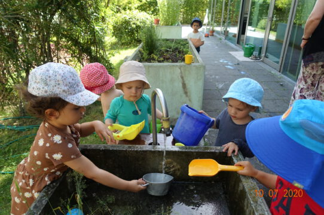
  

</section>

<section id="location" class="section-with-image">
  

    <h2>Lage</h2>
    

        Die Kinderkrippe liegt im Münchner Norden – im Stadtbezirk Milbertshofen/ Am Hart. Nebenan befindet sich das Einkaufszentrum MIRA.
    

        Das nahegelegene Naturschutzgebiet Nordheide und das Forstgebiet Hartlholz bieten vielseitige Möglichkeiten für Naturexkursionen. Mehrere öffentliche Spielplätze sowie weitere Kindertageseinrichtungen befinden sich im angrenzenden Neubaugebiet.
    

        Die Haltestelle U2 – Dülferstraße ist in zwei Minuten erreichbar und ermöglicht eine gute Anbindung zu den meisten Münchner Hochschulen (LMU, TU, FHM) sowie zur S-Bahn (Hbf) und die Innenstadt.
    

  

  

    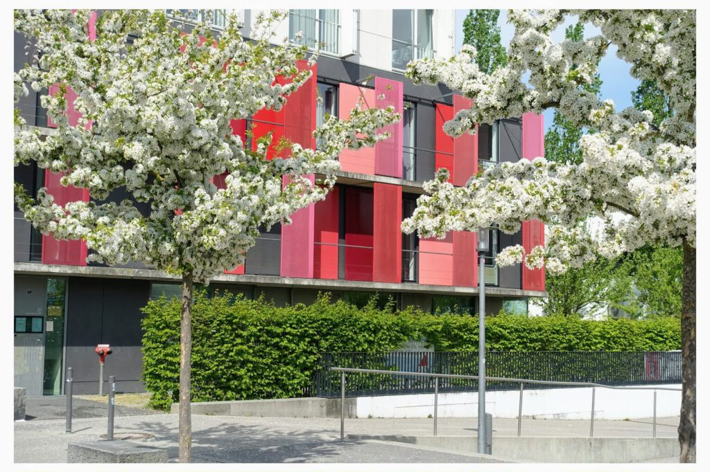
  

</section>

<section id="who-can-attend" class="section-with-image reverse">
  

    <h2>Wer kann unsere Einrichtung besuchen?</h2>
    

        Wir betreuen bevorzugt Kinder von Eltern, die:
    

        <ul>
            <li>
                an einer vom Studentenwerk München betreuten Hochschule eingeschrieben sind, oder
            </li>
            <li>
                MitarbeiterInnen der Universität, des Trägervereins oder des Studentenwerks Münchens sind.
            </li>
        </ul>
    

        Bitte nutzen Sie die Möglichkeit der Voranmeldung über das Online-Formular des Studentenwerks München oder persönlich in der Beratungsstelle Studieren mit Kind.
    

    

        Bitte melden Sie Ihr Kind unter dem Kita-Finder+ der Landeshauptstadt München bei uns an!    
    

  

  

    
  

</section>

<section id="association" class="section-with-image">
  

    <h2>Verein</h2>
    

        Die gegenseitige Wertschätzung, ein liebevoller Umgang und der Respekt voreinander lassen diesen Ort zu einem zweiten Zuhause werden – für die Kinder und ihre Eltern.
    

    

Unser Konzept ist einzigartig unter den Einrichtungen des Trägervereins:

    

Die Eltern unterstützen das Team der Krippe mit ca. 2-3 Nachmittagsdiensten im Monat sowie bei der Organisation und der Veranstaltung von Festen.

    

Jährlich werden aus dem Kreis der Eltern heraus die Vorstände der Krippe gewählt. Der Elternvorstand ist erster Ansprechpartner für Eltern und Team, zuständig für die administrativen Angelegenheiten (Verträge, Verwaltung, Präsenz) und kann durch seine Arbeit neue Impulse setzen oder Projekte realisieren.

    

Wir sind die einzige Krippe des Trägervereins, in der die Eltern so intensiv involviert sein können, den Tagesablauf aktiv miterleben dürfen und sogar selbst den Nachmittagssnack zubereiten.

    

Diese enge Zusammenarbeit stärkt das Vertrauen und das gegenseitige Verständnis.

  

  

    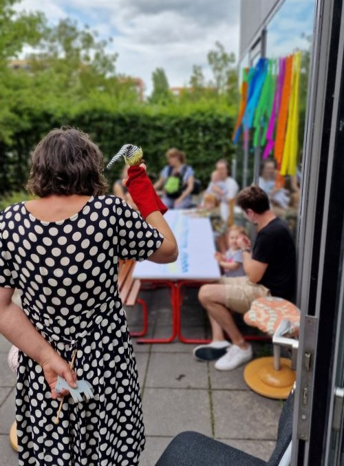
  

</section>

<section id="food" class="section-with-image reverse">
  

    <h2>Verpflegung</h2>
    

        Die Kinder erhalten in unserer Krippe Frühstück, Mittagessen und nachmittags eine Brotzeit, die jeweils von einem Elternteil vorbereitet wird.
    

    

      Dabei ist das Essen größtenteils vegetarisch (i.d.R. eine Fischmahlzeit pro Woche) und biologisch. 
    

  

  

    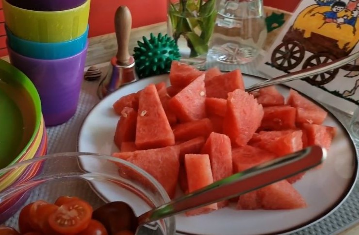
  

</section>

<section class="full-width-grey-section">
  

    

      <h2>Konzept</h2>
      

        Grundlage unserer Arbeit bildet ein gemeinsam von Eltern und Bezugspersonen erarbeitetes pädagogisches Konzept.
      

      

        <a href="{{ '/assets/documents/konzeption.pdf' | relative_url }}" class="button" download>Konzeption herunterladen</a>
      

    

    

      <h2>Öffnungszeiten</h2>
      

        Die Einrichtung öffnet täglich um 8:00 Uhr.
      

      

        Die Kernzeit ist von 10.00 Uhr bis 14.00 Uhr.
      

      

        Montag bis Donnerstag schließt die Krippe um 17 Uhr und am Freitag um 15 Uhr.
      

    

    

      <h2>Besichtigungstermine</h2>
      

        Sie können die Räumlichkeiten unserer Einrichtung nach telefonischer Anmeldung jederzeit besuchen.
      

    

  

</section>

<section id="team" class="content-section section-centered-no-bg">
  <h2>Team</h2>
  

    Unser Team besteht aus drei sehr erfahrenen Mitarbeiterinnen, die schon lange in dieser Einrichtung und Besetzung zusammen arbeiten.
  

  

    

      
      <h3 class="team-name">Selcan Kütük</h3>
      
Krippenleitung

    

    

      
      <h3 class="team-name">Patrizia Dellafiore-Berg</h3>
    

    

      
      <h3 class="team-name">Lydia Tothova</h3>
    

  

</section>

<section id="gallery" class="content-section section-centered-no-bg">
  <h2>Galerie</h2>
  

    In der Galerie können Sie einen ersten Eindruck über unsere Räume, Einrichtung und unseren schönen Garten bekommen.
  

  

    
    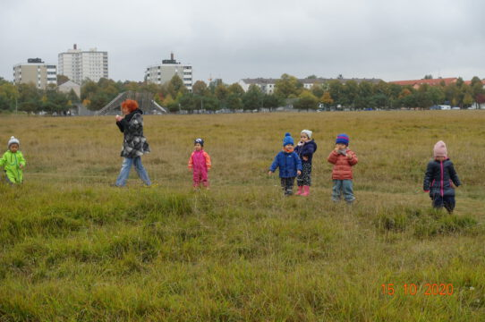
    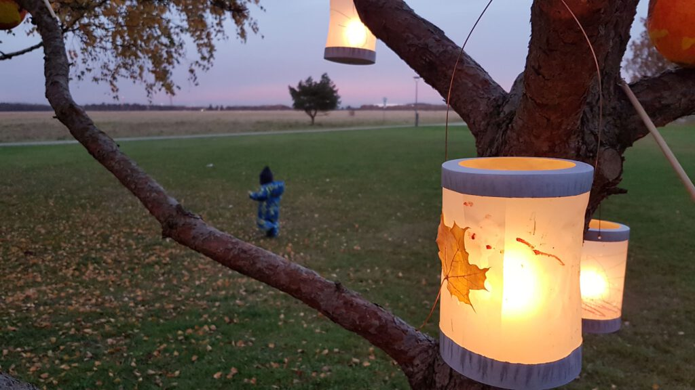
    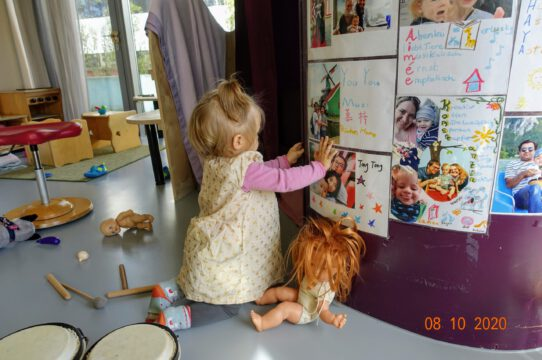
    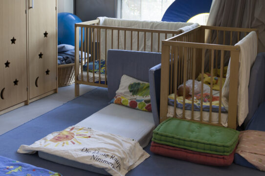
    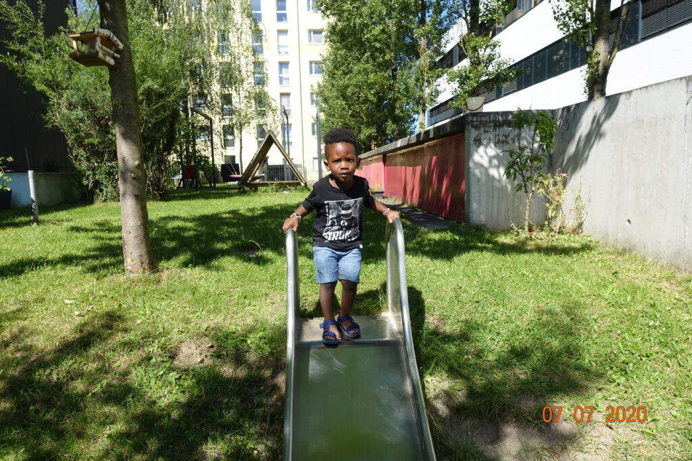
    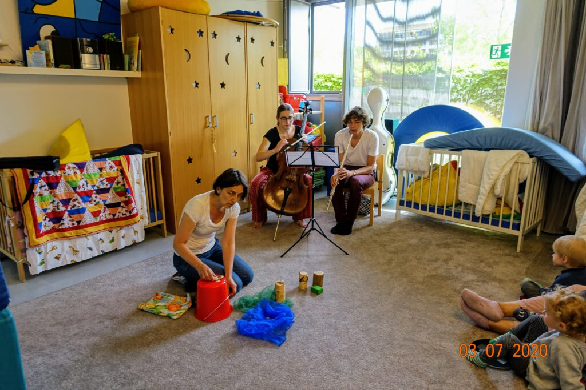
    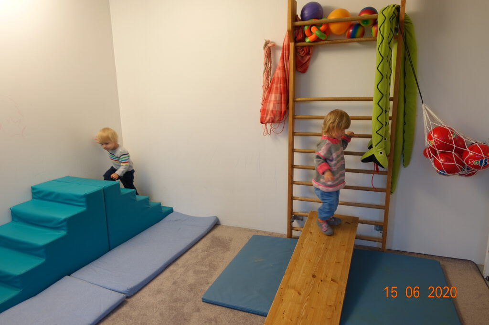
    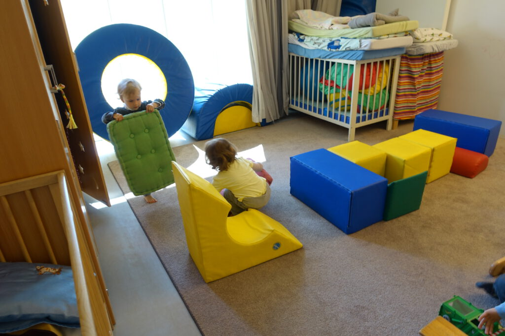
    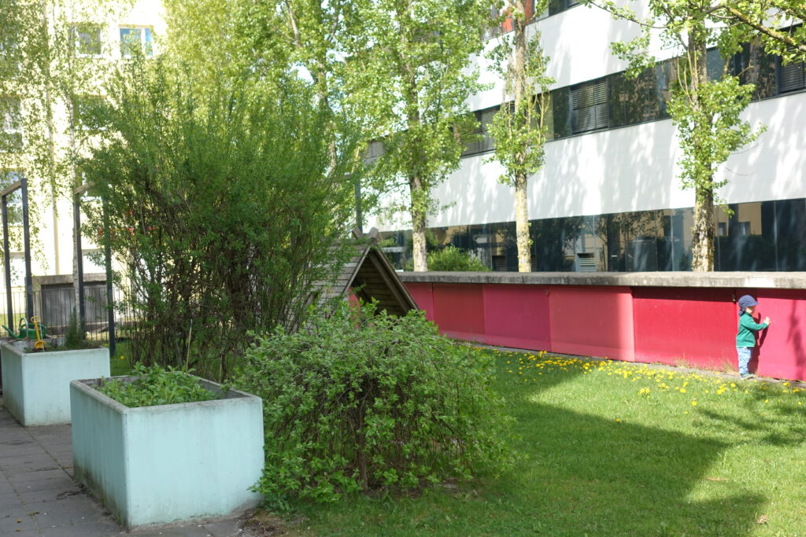
    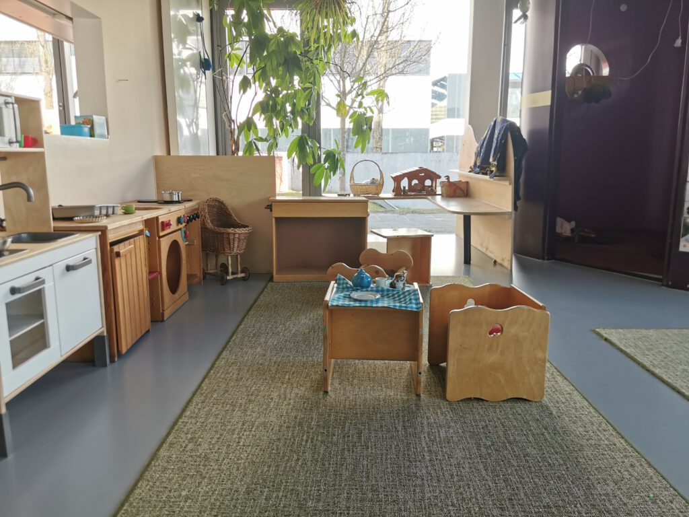
    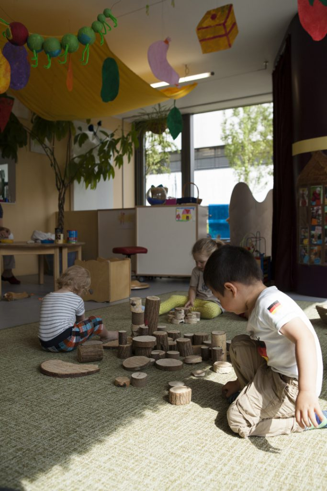
    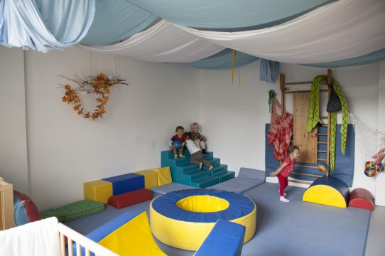
    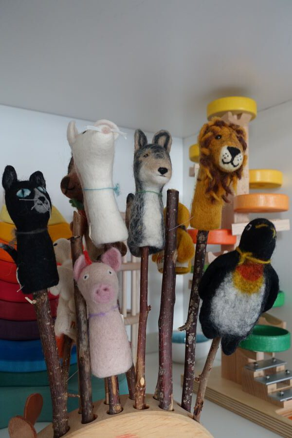
    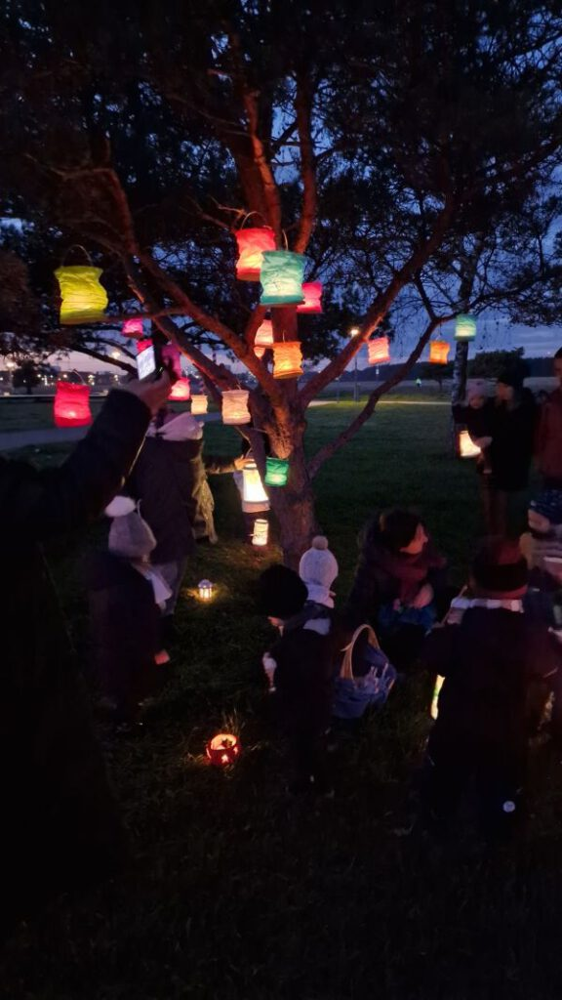
  

</section>
